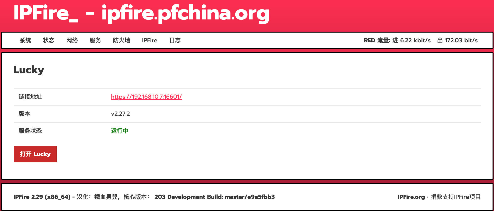

# Lucky for IPFire


本项目将 **Lucky** 集成到 IPFire WebUI 中，为用户提供便捷的图形化管理界面。

Lucky 是一款面向家庭网络和路由器场景的一体化管理工具，提供动态域名解析（DDNS）、ACME 证书管理、端口转发、Web 服务、计划任务等丰富功能。



---

## 功能特性

- 集成到 IPFire WebUI
- 简单的安装与卸载流程
- 动态域名解析（DDNS）管理
- ACME 证书自动申请与续期
- 端口转发管理
- Web 服务托管
- 计划任务管理
- 服务状态监控
- 与 IPFire 服务体系无缝集成

---

## 内置版本

| 组件 | 版本 |
|------|------|
| Lucky | v2.27.2 |
| 架构 | Linux x86_64 |
| IPFire | 2.29 |
| Core Update | 203 |

上游发布版本：

https://github.com/gdy666/lucky/releases/tag/v2.27.2

内置安装包：

lucky_2.27.2_Linux_x86_64.tar.gz

---

## 安装

将项目目录复制到 IPFire 系统后，以 root 用户执行：

```bash
cd "lucky for IPFire"

chmod +x install.sh uninstall.sh src/etc/rc.d/init.d/lucky src/srv/web/ipfire/cgi-bin/lucky.cgi src/opt/lucky/bin/lucky

./install.sh
```

---

## 访问 Lucky

安装完成后，在 IPFire WebUI 中访问：

```text
服务（Services） → Lucky
```

默认访问地址：

```text
https://IPFire-address:16601/
```

默认登录信息：

```text
用户名：666
密码：666
```

> ⚠️ 首次登录后请立即修改默认密码，并配置安全的访问路径。

---

## 运行路径

程序文件：

```text
/opt/lucky/bin/lucky
```

配置目录：

```text
/var/ipfire/lucky/conf
```

---

## 服务管理

启动服务：

```bash
/etc/rc.d/init.d/lucky start
```

停止服务：

```bash
/etc/rc.d/init.d/lucky stop
```

重启服务：

```bash
/etc/rc.d/init.d/lucky restart
```

查看状态：

```bash
/etc/rc.d/init.d/lucky status
```

---

## 卸载

```bash
cd "lucky for IPFire"
./uninstall.sh
```

卸载程序将删除：

- Lucky 服务
- WebUI 页面
- 菜单项
- 运行时文件

配置数据将保留在：

```text
/var/ipfire/lucky/conf
```

---

## 兼容性

| IPFire 版本 | 架构 | 状态 |
|------------|------|------|
| 2.29 Core 203 | x86_64 | ✅ 已测试 |

---

## 免责声明

这是一个非官方社区项目，与 IPFire 团队没有任何关联，也未获得其认可或支持。

部署前请自行审查源代码，并自行承担使用过程中可能产生的风险。

---

## 致谢

- Lucky 项目：https://github.com/gdy666/lucky
- IPFire 项目：https://www.ipfire.org/

---

## 许可证

请参阅上游 Lucky 项目及本仓库中的许可证文件。
